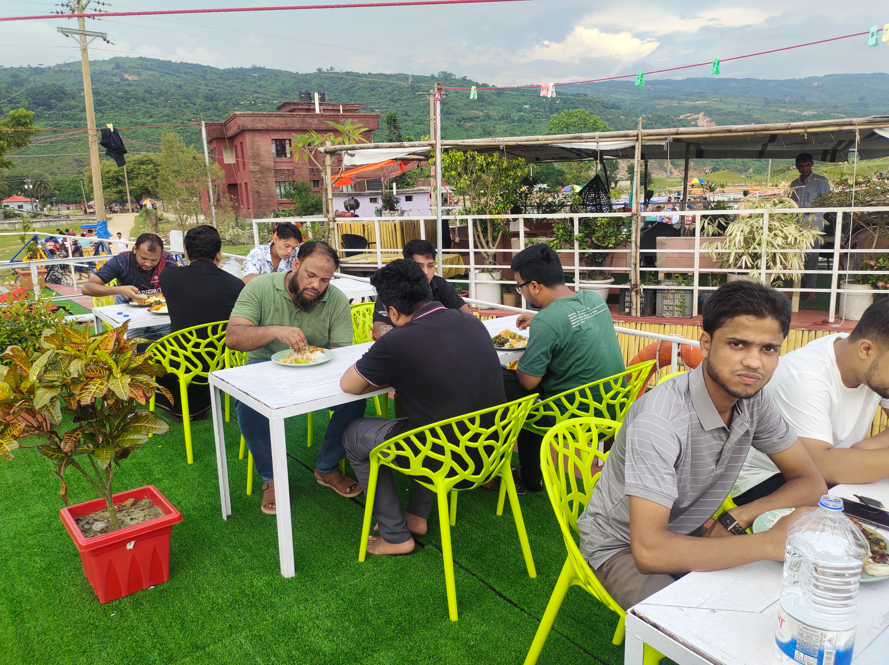

# 🛶 BHELA Houseboat — WordPress Theme

> Premium custom WordPress theme for **BHELA – The Haor Exclusive**, a family-friendly AC houseboat on Tanguar Haor, Sunamganj.



---

## ✨ Features

- **Photography-first, mobile-first** — designed for conversion
- **Monsoon haor palette** — deep teal, sunset orange, cloud grey
- **Interactive price estimator** — cabin × guests × day type → total cost + WhatsApp booking
- **60+ FAQ with Google FAQPage schema** — rich results ready
- **Sticky mobile conversion bar** — Call / WhatsApp / Book Now always visible
- **Floating WhatsApp button** — pre-filled booking inquiry message
- **Scroll reveal animations** — Intersection Observer, CSS-only, performant
- **Wave SVG dividers** — premium section transitions
- **Custom Post Types** — Guest Reviews (star ratings) + Trip Schedule (dates, status)
- **3 structured data schemas** — `FAQPage`, `TouristTrip`, `LocalBusiness`
- **Customizer integration** — contacts, social links, hero, booking CTA
- **Reduced motion** & print styles
- **Zero dependencies** — no jQuery, no page builders, no bloat

---

## 📁 Theme Structure

```
bhelahouseboat/
├── style.css                    — Theme metadata + design system
├── functions.php                — Setup, enqueues, CPTs, helpers
├── header.php / footer.php      — Nav, mobile bar, WhatsApp float
├── front-page.php               — Homepage
├── page.php / single.php        — Generic templates
├── 404.php / archive.php        — Error & archive
│
├── template-parts/              — Reusable homepage sections
│   ├── hero.php                 — Full-screen hero
│   ├── trust-bar.php            — USP strip
│   ├── cabin-cards.php          — 5 cabin types
│   ├── experience-spots.php     — 7 destination spots
│   ├── food-highlight.php       — Food teaser
│   ├── price-estimator.php      — Interactive calculator
│   ├── faq-accordion.php        — FAQ with schema
│   └── cta-section.php          — Final CTA
│
├── page-templates/              — Page-specific templates
│   ├── template-boat.php        — The Boat
│   ├── template-cabins.php      — Cabins & Rates
│   ├── template-schedule.php    — Trip Schedule
│   ├── template-experience.php  — Experience & Itinerary
│   ├── template-food.php        — Food Menu
│   ├── template-gallery.php     — Photo Gallery
│   ├── template-faq.php         — Full FAQ (60+)
│   ├── template-corporate.php   — Corporate & Full Boat
│   ├── template-contact.php     — Contact / Book Now
│   └── template-policy.php      — Policies
│
├── assets/
│   ├── css/                     — variables, components, pages, responsive
│   ├── js/                      — main, price-estimator, faq, gallery, smooth-scroll
│   └── images/                  — hero, boat, cabins, spots, food, logo
│
└── inc/
    ├── custom-post-types.php    — Reviews + Trip Schedule CPTs
    ├── customizer.php           — BHELA Settings panel
    └── schema.php               — JSON-LD structured data
```

---

## 🚀 Installation

1. Copy the `bhelahouseboat` folder to `wp-content/themes/`
2. Go to **WordPress Admin → Appearance → Themes**
3. Activate **BHELA Houseboat**

---

## ⚙️ Setup After Activation

### 1. Create Pages

Create the following pages and assign their templates via **Page Attributes → Template**:

| Page Title | Slug | Template |
|------------|------|----------|
| হোম | *(any)* | *(set as Front Page in Reading Settings)* |
| ভেলা পরিচিতি | `the-boat` | The Boat |
| কেবিন ও রেট | `cabins` | Cabins & Rates |
| ট্রিপ সিডিউল | `trip-schedule` | Trip Schedule |
| অভিজ্ঞতা | `experience` | Experience |
| খাবার মেনু | `food-menu` | Food Menu |
| গ্যালারি | `gallery` | Gallery |
| FAQ | `faq` | FAQ |
| Corporate | `corporate` | Corporate |
| যোগাযোগ | `contact` | Contact |
| নীতিমালা | `policies` | Policies |

### 2. Configure Settings

Go to **Appearance → Customize → BHELA Settings** and configure:
- Phone numbers & WhatsApp
- Social media links
- Hero tagline & background image
- Booking CTA text

### 3. Add Trip Dates

Go to **Trip Schedule** in the admin sidebar and add upcoming trip dates with start/end dates, day type, and availability status.

### 4. Add Guest Reviews

Go to **Guest Reviews** in the admin sidebar and add reviews with star ratings.

---

## 🎨 Design System

| Token | Color | Hex |
|-------|-------|-----|
| Primary | Haor Deep Teal | `#0E6E6B` |
| CTA | Sunset Orange | `#F2762E` |
| Monsoon | Cloud Blue-Grey | `#8FA8B8` |
| Sand | Warm Neutral | `#F5EFE4` |
| Text | Near-black | `#1B2B2A` |
| Background | Off-white | `#FAFAF7` |

**Typography:** Hind Siliguri (BN headings) · Noto Sans Bengali (BN body) · Poppins (EN headings) · Inter (EN body)

---

## 📋 Requirements

- WordPress 6.0+
- PHP 8.0+
- No plugins required for core functionality

---

## 👨‍💻 Development

**Author:** [3s-Soft](https://3s-soft.com)  
**Version:** 1.0.0  
**License:** GPL v2+

---

## 📞 Support

For questions or customizations, contact: **infobhela@gmail.com**
